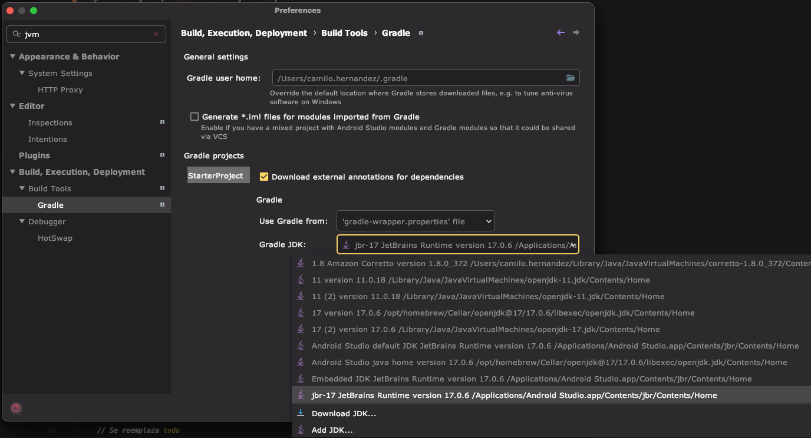

# Starter Project

Plantilla para todo proyecto Android que fuera a crearse desde cero. Todo proyecto inicial puede
llegar a ser igual que este con los siguientes pasos.

Pasos a seguir para adaptar el proyecto nuevo:

1. Crear el proyecto desde la plantilla Empty Activity con Compose

   

2. Pegar el build.gradle a nivel de proyecto
    ```groovy
    buildscript {
        ext {
            compose_version = '1.4.3'
            hilt_version = '2.46.1'
        }
    }
    // Top-level build file where you can add configuration options common to all sub-projects/modules.
    plugins {
         id 'com.android.application' version '8.0.2' apply false
         id 'com.android.library' version '8.0.2' apply false
         id 'org.jetbrains.kotlin.android' version '1.8.10' apply false
         id 'com.google.dagger.hilt.android' version "$hilt_version" apply false
         id "org.jetbrains.kotlin.plugin.serialization" version "1.8.10" apply false // Si se usa kotlinx.serialization
    }
    ```

3. Configurar la versión del Gradle JDK a la versión más alta de la JVM LTS disponible (versión 17 actualmente) teniendo cuidado
que las rutas coincidan con la variable de entorno $JAVA_HOME. En MacOS, el menú de configuración
se abre presionando CMD + ; o yendo al menú de preferencias/configuraciones.

   

4. Pegar los siguientes campos del build.gradle a nivel de app
    ```groovy
    plugins {
        id 'com.android.application'
        id 'org.jetbrains.kotlin.android'
        id 'kotlin-kapt'
        id 'dagger.hilt.android.plugin'
        id 'org.jetbrains.kotlin.plugin.serialization' // Si se elige kotlinx.serialization para serialización
    }
    
    // La versión de la JVM debe ser la misma configurada en la versión del Gradle JDK del paso anterior 
    compileOptions {
        sourceCompatibility JavaVersion.VERSION_17
        targetCompatibility JavaVersion.VERSION_17
    }
    kotlinOptions {
        jvmTarget = '17'
    }
    composeOptions {
        kotlinCompilerExtensionVersion compose_version
    }
   
    dependencies {
       // Core
       // Proporciona funcionalidades para el desarrollo de aplicaciones Android con las ventajas que tiene Kotlin sobre Java
       implementation 'androidx.core:core-ktx:1.10.1'

       // Dependencias de prueba generales
       testImplementation 'junit:junit:4.13.2'
       androidTestImplementation 'androidx.test.ext:junit:1.1.5'
       androidTestImplementation 'androidx.test.espresso:espresso-core:3.5.1'

       // Activity for Compose
       implementation 'androidx.activity:activity-compose:1.7.2'

       // Compose Bom
       def compose_bom = 'androidx.compose:compose-bom:2023.06.01'
       implementation platform(compose_bom)
       androidTestImplementation platform(compose_bom)
       implementation 'androidx.compose.material3:material3'
       implementation 'androidx.compose.ui:ui'
       implementation 'androidx.compose.ui:ui-graphics'
       implementation 'androidx.compose.ui:ui-tooling-preview'
       implementation "androidx.compose.foundation:foundation"
       debugImplementation 'androidx.compose.ui:ui-test-manifest'
       debugImplementation 'androidx.compose.ui:ui-tooling'
       androidTestImplementation 'androidx.compose.ui:ui-test-junit4'

       // Navigation Compose
       implementation "androidx.navigation:navigation-compose:2.6.0"

       // Lifecycle dependencies
       def lifecycle_version = "2.6.1"
       implementation "androidx.lifecycle:lifecycle-viewmodel-compose:$lifecycle_version"
       implementation "androidx.lifecycle:lifecycle-viewmodel-ktx:$lifecycle_version"
       implementation "androidx.lifecycle:lifecycle-runtime-ktx:$lifecycle_version"

       // Splash Screen API
       implementation "androidx.core:core-splashscreen:1.0.1"

       // Dependencias para usar Hilt, una biblioteca que simplifica la inyección de dependencias en Android
       // Dagger Hilt
       implementation "com.google.dagger:hilt-android:$hilt_version"
       kapt "com.google.dagger:hilt-android-compiler:$hilt_version"
       // Androidx Hilt
       implementation 'androidx.hilt:hilt-navigation-compose:1.0.0'
       kapt "androidx.hilt:hilt-compiler:1.0.0"
       // Instrumentation tests for Hilt
       androidTestImplementation  "com.google.dagger:hilt-android-testing:$hilt_version"
       kaptAndroidTest "com.google.dagger:hilt-compiler:$hilt_version"
       // Local unit tests for Hilt
       testImplementation "com.google.dagger:hilt-android-testing:$hilt_version"
       kaptTest "com.google.dagger:hilt-compiler:$hilt_version"

       // Coil: Dependencia para cargar imágenes
       implementation 'io.coil-kt:coil-compose:2.4.0'

       // Coroutines, una biblioteca que permite escribir código asíncrono de forma secuencial y sin bloqueos
       def coroutines_version = '1.7.2'
       implementation "org.jetbrains.kotlinx:kotlinx-coroutines-core:$coroutines_version"
       implementation "org.jetbrains.kotlinx:kotlinx-coroutines-android:$coroutines_version"

       // Room, una biblioteca que provee una capa de abstracción sobre SQLite para facilitar el acceso a datos persistentes
       def room_version = '2.5.2'
       implementation "androidx.room:room-runtime:$room_version"
       kapt "androidx.room:room-compiler:$room_version"
       // Kotlin Extensions and Coroutines support for Room
       implementation "androidx.room:room-ktx:$room_version"

       // Retrofit (elegir entre Retrofit y Ktor para peticiones HTTP)
       def retrofit_version = '2.9.0'
       implementation "com.squareup.retrofit2:retrofit:$retrofit_version"

       // OkHttp (estable)
       //noinspection GradleDependency
       implementation "com.squareup.okhttp3:okhttp:4.11.0"
    
       // --- Serializadores: elegir entre Gson y kotlinx.serialization
       // Gson converter
       implementation "com.squareup.retrofit2:converter-gson:$retrofit_version"
       // Kotlinx.serialization
       implementation "org.jetbrains.kotlinx:kotlinx-serialization-json:1.5.1"
       // Retrofit with Kotlin serialization Converter
       implementation "com.jakewharton.retrofit:retrofit2-kotlinx-serialization-converter:1.0.0"

       // Ktor Client (elegir entre Retrofit y Ktor para peticiones HTTP)
       def ktor_version = '2.3.2'
       implementation "io.ktor:ktor-client-core:$ktor_version"
       implementation "io.ktor:ktor-client-android:$ktor_version"
       implementation "io.ktor:ktor-client-serialization:$ktor_version"
       implementation "io.ktor:ktor-client-logging:$ktor_version"
       implementation "io.ktor:ktor-client-content-negotiation:$ktor_version"
       implementation "io.ktor:ktor-serialization-kotlinx-json:$ktor_version"
       implementation "ch.qos.logback:logback-classic:1.2.12"
    }
    ```

4. Agregar el permiso de internet en el AndroidManifest.xml
    ```xml
        <uses-permission android:name="android.permission.INTERNET"/>
    ```
